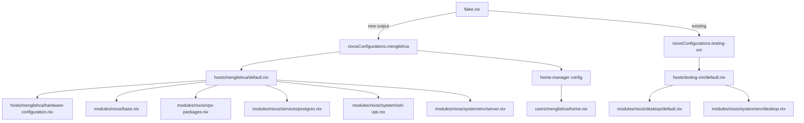

# Plan: Add VPS Host `menglishca`

## Overview

Add a new headless NixOS host named `menglishca` to the flake-based configuration for a DigitalOcean VPS running Postgres, Python, and Librechat. Also refactor [`env.nix`](modules/nixos/system/env.nix) into an `env/` folder with base, desktop, and server variants.

## Architecture



## Step 0: Refactor `env.nix` into `env/` folder

Replace the single [`modules/nixos/system/env.nix`](modules/nixos/system/env.nix) with a folder:

```
modules/nixos/system/env/
  default.nix    -- base, shared by all hosts
  desktop.nix    -- desktop-specific variables
  server.nix     -- server-specific variables
```

**`modules/nixos/system/env/default.nix`** -- base:
- Empty initially, or with truly universal variables

**`modules/nixos/system/env/desktop.nix`** -- desktop-specific:
- `JAVA_HOME`, `TERMINAL`, `BROWSER`

**`modules/nixos/system/env/server.nix`** -- server-specific:
- Empty initially, ready for future use

Then update existing files:
- [`modules/nixos/system/default.nix`](modules/nixos/system/default.nix) -- change `./env.nix` to `./env` (picks up `default.nix`)
- [`hosts/testing-vm/default.nix`](hosts/testing-vm/default.nix) -- add import of `../../modules/nixos/system/env/desktop.nix`

## Step 1: Create host directory and files

**[`hosts/menglishca/default.nix`](hosts/menglishca/default.nix)** -- imports:
- `./hardware-configuration.nix`
- `../../modules/nixos/base.nix`
- `../../modules/nixos/vps-packages.nix`
- `../../modules/nixos/services/postgres.nix`
- `../../modules/nixos/system/ssh-vps.nix`
- `../../modules/nixos/system/env/server.nix`

Does NOT import: desktop, stylix, boot modules

**[`hosts/menglishca/hardware-configuration.nix`](hosts/menglishca/hardware-configuration.nix)** -- placeholder for DigitalOcean, to be replaced after `nixos-generate-config`

## Step 2: Create VPS-specific NixOS modules

**`modules/nixos/vps-packages.nix`** -- packages:
- git, tmux, nano, jq
- python3
- librechat

**`modules/nixos/services/postgres.nix`** -- PostgreSQL:
- `services.postgresql.enable = true`
- Open firewall port 5432

**`modules/nixos/system/ssh-vps.nix`** -- public SSH:
- Override firewall rules from [`ssh.nix`](modules/nixos/system/ssh.nix) to allow public SSH access

## Step 3: Create stripped-down Home Manager config

**[`users/menglishca/home.nix`](users/menglishca/home.nix)** -- imports only:
- `../../modules/home/base.nix`
- `../../modules/home/programs/bash.nix`
- `../../modules/home/programs/git.nix`
- `../../modules/home/programs/tmux.nix`

## Step 4: Add flake output

Add `nixosConfigurations.menglishca` to [`flake.nix`](flake.nix) following the same pattern as `testing-vm` but pointing to the VPS host and user.

## Step 5: Generate hardware-configuration.nix on VPS

After initial NixOS installation on DigitalOcean:
1. Run `nixos-generate-config` on the VPS
2. Copy the generated `hardware-configuration.nix` to replace the placeholder

## Files to Create

| File | Purpose |
|------|---------|
| `hosts/menglishca/default.nix` | VPS host entry point |
| `hosts/menglishca/hardware-configuration.nix` | Placeholder hardware config |
| `modules/nixos/vps-packages.nix` | VPS-specific system packages |
| `modules/nixos/services/postgres.nix` | PostgreSQL service |
| `modules/nixos/system/ssh-vps.nix` | Public SSH access config |
| `modules/nixos/system/env/default.nix` | Base environment variables |
| `modules/nixos/system/env/desktop.nix` | Desktop environment variables |
| `modules/nixos/system/env/server.nix` | Server environment variables |
| `users/menglishca/home.nix` | Stripped-down Home Manager |

## Files to Modify

| File | Change |
|------|--------|
| `flake.nix` | Add `nixosConfigurations.menglishca` output |
| `modules/nixos/system/default.nix` | Change `./env.nix` import to `./env` |
| `modules/nixos/system/env.nix` | Delete (replaced by `env/` folder) |
| `hosts/testing-vm/default.nix` | Add import of `env/desktop.nix` |

## Notes

- [`modules/nixos/base.nix`](modules/nixos/base.nix) sets `networking.networkmanager.enable = true` -- fine to keep on VPS, NetworkManager works headless too
- [`modules/nixos/system/users.nix`](modules/nixos/system/users.nix) includes `vboxusers` group -- harmless on VPS but could be split later if desired
- Librechat will need a `.env` file for API keys configured manually after deployment
